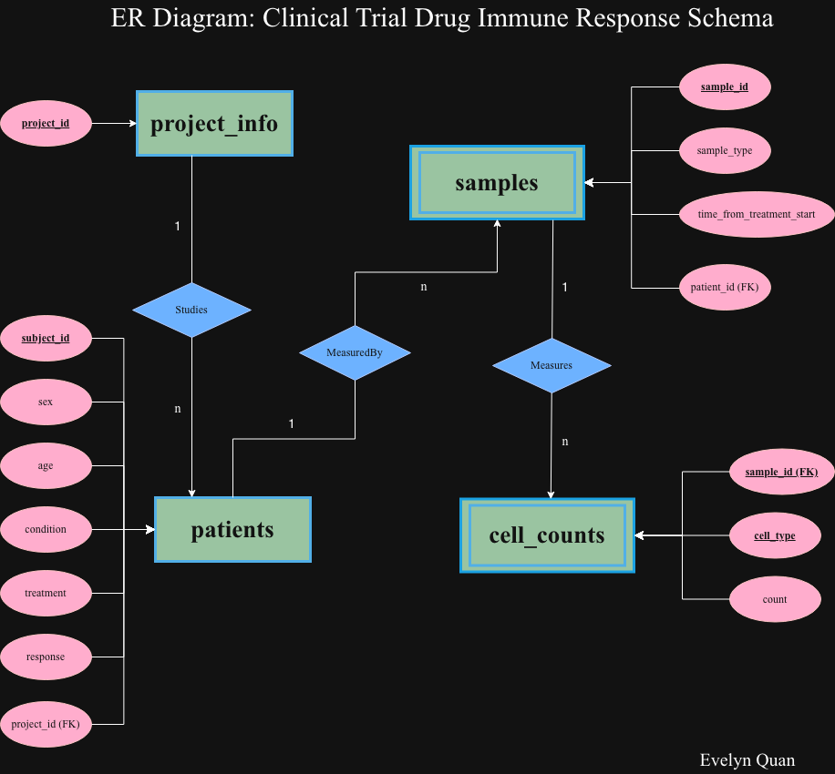

# Clinical Trial Immune Cell Populations Analysis

Using cell count data for immune cell populations from patient samples, I analyzed how a potential drug candidate affected the relative frequencies of these cell types in responders vs. non-responders. I also built an interactive dashboard to display the results of my analyses.

## Instructions to Run Code

Begin by cloning this repository and entering the project directory:

```
git clone https://github.com/evelynsq/immune-response-trial-analysis.git
cd immune-response-trial-analysis/
```

Python version 2.5 or higher is required for running this platform, as these versions include `sqlite3` as part of the Python standard library.

Additional required Python packages include:

- dash
- dash-bootstrap-components
- matplotlib
- pandas
- plotly
- scipy
- seaborn

To install all these dependencies, run the following in the terminal:

```
make setup
```

To execute the entire data pipeline and generate outputs, run:

```
make pipeline
```

To start the interactive dashboard of the analysis results, run:

```
make dashboard
```

*Note: If you are interested in executing a single script by itself, please run it while remaining in the project's root directory. Do not change into a subdirectory.*


## Relational Database Schema: Explanation and Rationale

There are four tables used for the database `drug-response.db`:

1. *project_info*
2. *patients*
3. *samples*
4. *cell_counts*



*project_info* only contains a single `project_id` column, as I considered how future projects may have more project-related information the drug developer would like to include as part of the analysis (i.e. project codes, clinical trial phase, location, etc.), which may not necessarily relate to the patients or samples.

I also decided to keep the cell counts in their own table (*cell_counts*), as this would make it easier to manage the immune cell count data in the future if there were additional cell populations of interest to study. We would simply add them to *cell_counts* rather than overload other existing tables with additional columns.

One project can have many patients, one patient can have many samples, and one sample can contain many cell types, hence the 1-to-many relationship of these respective tables. All data in the tables are connected and consistent due to the use of foreign keys relating one table to another. Every column in a table depends directly on the primary key of its table as well.

My relational database schema would scale well with a growing number of projects, samples, or types of analytics to perform. By keeping a separate table for *project_info*, this makes it easier to add more project-related information in the future and also perform project-specific metadata analyses without affecting other parts of the data unrelated to the project's overhead. Additionally, the database's information is organized by distinctive entities which makes it easy to understand which table your new information should go into in the future, and has descriptive, easy-to-follow column names. Furthermore, by changing the `response` status in the *patients* table from "yes" and "no" to 1 and 0, this helps to save space by not storing as many strings in the database.


## Code Structure Overview and Design

```
.
├── Makefile
├── README.md
├── app.py
├── cell-count.csv
├── drug-response.db
├── images
│   ├── Code-Structure.png
│   └── ER-Diagram.png
├── load_data.py
├── outputs
│   ├── part-2
│   ├── part-3
│   └── part-4
├── requirements.txt
└── src
    ├── __pycache__
    ├── data_subset_analysis.py
    ├── stat_analysis.py
    └── summary_table.py
```

With the exception of `load-data.py`, the source code for the analysis Steps 2-4 can be found in the __src__ subdirectory, divided into separate files for each part. All outputs generated are divided into subfolders in __outputs__ based on which step they were produced in. These choices were made to keep the repository more organized and understandable.

## Access the Dashboard

Please run `make dashboard` and visit the URL noted in your terminal to access the interactive dashboard with the analysis results.

For instance, you may see something similar to this:

```
immune-response-trial-analysis % make dashboard
python app.py
Dash is running on http://127.0.0.1:8050/
```
